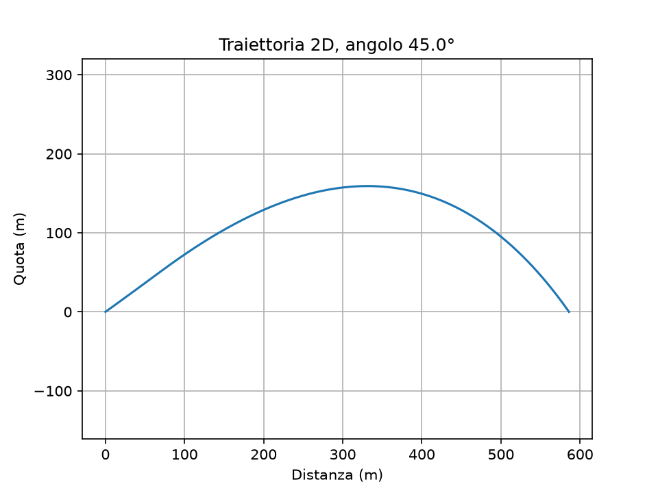

# Rocket Sim
Simulatore di traiettoria di un razzo in Python.
Primo modello: lancio verticale con gravità, integrato con il metodo di Eulero e confrontato con la soluzione analitica.
Il drag riduce la quota massima da X m a Y m. Aumentare la massa avvicina la traiettoria al caso senza aria.
# Rocket Sim

Simulatore di traiettoria di un razzo in Python, costruito passo dopo passo
durante il primo anno di Ingegneria Aerospaziale.

## Obiettivo
Capire come si simula un moto fisico con l'integrazione numerica e come i
vari effetti (gravità, resistenza dell'aria, spinta) cambiano la traiettoria.

## Modelli implementati

### 1. Lancio verticale con gravità (`razzo.py`)
- Integrazione numerica con il metodo di Eulero (passo `dt`).
- Confronto con la soluzione analitica y = v0·t - ½·g·t².
- Osservazione: con `dt` grande l'errore cresce, perché Eulero assume la
  velocità costante durante ogni passo.

### 2. Lancio verticale con resistenza dell'aria (`razzo_drag.py`)
- Forza di drag: F = ½·ρ·Cd·A·v², sempre opposta al moto.
- Parametri: m = 1 kg, ρ = 1.225 kg/m³, Cd = 0.75, A = 0.005 m², v0 = 100 m/s.

| | Senza aria | Con aria |
|---|---|---|
| Quota massima | [0.00008+2.037736e3] m | [0.00084+2.037736e3] m |
| Tempo di volo | [20.380] s | [11.51] s |

## Cosa ho osservato
- Aumentando la massa, la traiettoria si avvicina a quella senza aria
  (l'accelerazione frenante è drag/m).
- Aumentando la sezione A, la traiettoria si allontana: il drag è
  proporzionale ad A.
- Aumentando la velocità iniziale, l'effetto dell'aria cresce più che
  proporzionalmente perché il drag dipende da v².
- Il parametro che conta è il coefficiente balistico m/(Cd·A).

## Come eseguirlo
pip3 install numpy matplotlib
python3 razzo.py
python3 razzo_drag.py

## Prossimi passi
- [X] Spinta del motore e perdita di massa
- [X] Densità dell'aria variabile con la quota
- [X] Traiettoria 2D con angolo di lancio
### 3. Razzo con motore (`razzo_motore.py`)
- Parte da fermo, spinta 120 N per 2 s, perdita di massa del propellente.
- Quota massima: 331.8 m, velocità massima: 82.4 m/s.
### Razzo con motore (`razzo_motore.py`)
- Spinta 120 N per 2 s: quota 331.8 m, velocità max 82.4 m/s.
- Spinta 240 N per 2 s: quota 803.4 m, velocità max 171.2 m/s.
- Stesso impulso con spinta 60 N per 4 s: quota 283.4 m, velocità max 62.1 m/s.
- Conclusione: a parità di propellente, bruciare più a lungo aumenta la
  perdita per gravità (circa g · t_burn) e riduce la velocità finale.
### 4. Traiettoria 2D (`razzo_2d.py`)
- Spinta orientata secondo l'angolo di lancio, drag vettoriale opposto
  alla velocità, densità atmosferica variabile con la quota.
- Test di coerenza: a 90° riproduce il caso verticale (333.2 m contro
  331.8 m; la differenza è dovuta alla densità variabile).

| Angolo | Quota max | Gittata | Tempo di volo |
|---|---|---|---|
| 30° | 73.2 m | 531.0 m | 8.9 s |
| 40° | 129.5 m | 584.2 m | 11.4 s |
| 45° | 159.2 m | 586.0 m | 12.5 s |
| 50° | 188.8 m | 572.8 m | 13.5 s |
| 60° | 244.6 m | 503.5 m | 15.2 s |

- La gittata massima si trova a circa 43°, poco sotto i 45° ideali, a
  causa della resistenza dell'aria.
- Senza aria (45°) la gittata sarebbe 1007.5 m: il drag ne elimina il 42%.

